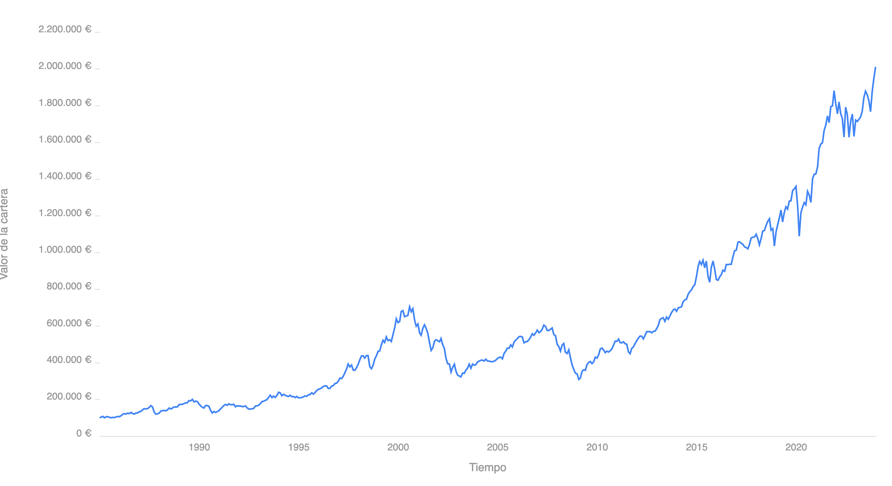

Quería estrenar el blog con un tema que, a pesar de tener un impacto enorme sobre la vida de todos nosotros, sigue teniendo un protagonismo relativamente menor, tanto en los medios de comunicación como en el debate público. Sí, de vez en cuando se habla de las pensiones, pero normalmente la conversación es muy superficial y con argumentos muy simples, quedando a menudo simplificado a un enfrentamiento entre ideologías y sin hacer un análisis detallado que ayude a entender los problemas y las posibles soluciones. Con este post voy a tratar de resumir algunos de estos puntos de forma sencilla para facilitar dicho debate.

## Origen

### Retiro Obrero

Curiosamente, el sistema actual de reparto tuvo un predecesor que podríamos llamar de capitalización. Fue el llamado **Retiro Obrero**[^1], aprobado en 1919, por el cual el Estado aportaba una peseta al mes por cada trabajador en activo, mientras que los patronos aportaban tres pesetas al mes. Este dinero era gestionado por los bancos y cajas de ahorro, y daba derecho a los trabajadores con pocos ingresos a una pensión de una peseta al día (365 al año) a partir de los 65 años. Este importe suponía tan solo entre el 10% y el 20% del salario medio de un obrero, y estaba por tanto concebido como una ayuda contra la pobreza, no como nuestras actuales pensiones de jubilación.

Sin embargo, la llegada de la guerra imposibilitó que los primeros partícipes de este sistema pudieran llegar a beneficiarse de él. Estos ahorros se habían acumulado en forma de **pesetas republicanas**, una moneda que sufrió una enorme devaluación durante la guerra civil[^2] (frente a la estabilidad de la peseta nacional), y que finalmente terminaría desapareciendo. Por tanto, al terminar la guerra, esas pensiones ahorradas en pesetas republicanas no valían nada, y Franco tuvo que buscar una solución para sustentar a esos trabajadores de bajos ingresos que estaban a punto de jubilarse, pero que habían perdido la pensión que habían acumulado. Fueron estos problemas los que motivaron la migración a un sistema de reparto: el **Subsidio de Vejez**.

### Subsidio de Vejez

Con este sistema, que al igual que su predecesor sólo cubría a los jubilados con bajos ingresos, los trabajadores en activo empezaban a pagar de inmediato las pensiones de los jubilados, que recibían una pensión vitalicia fija y garantizada. Se eliminaba por tanto el componente de ahorro del sistema, sorteando así el principal problema en aquel momento: la **falta de tiempo** para que los trabajadores más mayores volviesen a acumular suficientes ahorros antes de jubilarse. A cambio, los jubilados pasaban a ser completamente dependientes de los trabajadores en activo de ese momento. Era, en esencia, una transferencia de riqueza de los trabajadores a los jubilados.

Más tarde, este sistema se expandiría para cubrir a todos los jubilados, solidificando aún más esa dependencia intergeneracional de cara al futuro.

## Limitaciones de los sistemas de reparto

### Ausencia de rentabilidad

Uno de los principales problemas de las pensiones basadas en el reparto es que se renuncia por completo a la revalorización del capital a lo largo del tiempo. Cada euro aportado por un trabajador en activo se gasta al mes siguiente en pagarle un euro a un pensionista, y por tanto no tiene tiempo de producir rentabilidad alguna en los mercados. Esto constituye un tremendo coste de oportunidad, puesto que el tiempo, recurso tan abundante para una persona que comienza a trabajar, es precisamente el **factor más crítico** para invertir con éxito.

Por ejemplo, una inversión de 100.000€ realizada en enero de 1985 en un indexado al MSCI World (ignoremos para este ejercicio teórico la disponibilidad de vehículos indexados en aquella época) habría alcanzado en enero de 2024, 39 años después, un valor aproximado de 2.000.000€:

*Backtest de una inversión de 100.000€ en el ETF Amundi MSCI World V: 1985-2024 [^3]*

Esto supone una revalorización de 20 veces el capital invertido, y una rentabilidad anualizada de un 8% aproximadamente. Incluso si tenemos en cuenta el efecto de la inflación en España a lo largo de esos 39 años, esos 2.000.000€ equivaldrían a unos 570.000€ de 1985 [^4], lo cual seguiría suponiendo una revalorización de más de 5 veces el capital invertido en términos reales, y una rentabilidad real anualizada del 4,5%.

Hay que remarcar que esto sólo es un ejercio teórico para ilustrar el coste de oportunidad de *no* invertir a largo plazo. Para hacer una simulación más realista, habría que considerar algunas variables más:
* La inversión no se haría de golpe al inicio, sino poco a poco en aportaciones mensuales.
* Las aportaciones serían más pequeñas al principio y crecerían progresivamente, puesto que habitualmente el salario y la capacidad de ahorro del trabajador aumentan con el tiempo.
* Un inversor prudente no llevaría el 100% de su cartera invertida en renta variable durante toda su vida, sino que iría introduciendo renta fija a medida que se acerca su jubilación para protegerse de la volatilidad de los mercados.

Pero lo importante es entender que, cuando se tienen décadas por delante, el poder de revalorización del capital invertido es enorme. Quien va a necesitar su dinero en 5 años no tiene ese lujo, ya que no podrá asumir el riesgo que implica la renta variable, y además tampoco podrá beneficiarse de la composición de rentabilidades que sólo proporciona el largo plazo. Y esas circunstancias de urgencia fueron las que motivaron la adopción del sistema de reparto tras la guerra. Pero en condiciones normales, un sistema de pensiones trabaja con periodos de más de 40 años, que es la duración de la vida laboral de sus partícipes. Por tanto, no invertir el dinero que entra en ese sistema supone una enorme destrucción de riqueza para el país.

### Estructura piramidal

En ausencia de rentabilidad alguna, resultaba imprescindible mantener un alto ratio de trabajadores por pensionista para que la cuantía de la prestación fuese lo bastante alta.

[^1]: [Wikipedia | Retiro Obrero](https://es.wikipedia.org/wiki/Retiro_Obrero)
[^2]: [20 minutos | Así acabó la Guerra Civil con la peseta republicana hace ahora ochenta años](https://www.20minutos.es/lainformacion/economia-y-finanzas/asi-acabo-guerra-civil-con-peseta-republicana-hace-ahora-ochenta-anos-5368503/)
[^3]: Fuente: [Curvo.eu | Backtest del ETF Amundi MSCI World (ISIN LU1781541179) desde enero de 1985 hasta enero de 2024](https://curvo.eu/backtest/es/cartera/benchmark-global-100-rv--NoIgQgpgdgxgFgWwIYCcDWACA4gGwPYBGSOGAjAAzkCkGASgGogA0woAMgKqkDsAHKQFYALKR4BOZqQC6MoA?config=%7B%22investmentPatterns%22%3A%5B%5B%22one-off%22%2C100000%5D%5D%2C%22periodStart%22%3A%221985-01%22%2C%22periodEnd%22%3A%222024-01%22%7D)
[^4]: Dato obtenido de la [Calculadora de IPC del INE](https://www.ine.es/calcula/)