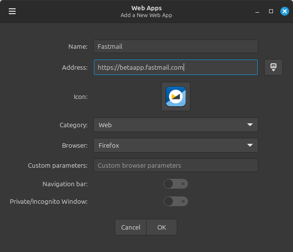
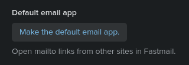
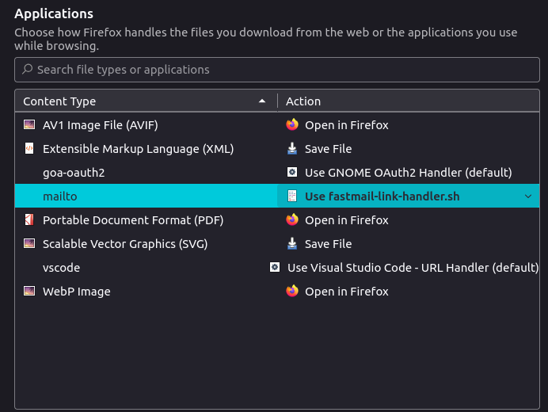

Although the ongoing demise of desktop applications in favour of web apps is affecting all operating systems, Linux users are especially familiar with it. Due to its comparatively small market share, Linux is typically the lowest hanging fruit when it comes to cutting on development efforts. The rise of powerful, highly functional web apps has only accelerated this trend.

Unfortunately, some services and applications can lose valuable functionality when native apps are removed from the equation, and email is a good example of this: background mailbox monitoring, proper notifications, handling of mailto links or offline support are all things that can be lost without a desktop app. Third party email clients (such as Thunderbird) can cover these gaps, but they come with their own set of compromises: loss of provider-specific features, varying levels of quality and UI polish, questionable business models, etc.

Luckily, due to its open source and customizable nature, Linux provides the necessary tools to turn any webmail service, such as Fastmail, into a fully fledged desktop app.

In this post, I'm going to show the steps you can follow to integrate Fastmail as the default email client on Linux Mint 22.1 (Cinnamon Desktop) as tightly as a native desktop app would be. Once done, this is what we will have:

* A standalone email client app, independent from our usual web browser.
* This web app will be registered and recognized as our default email client by the system.
* `mailto:` links will correctly open in this app when clicked from a normal web browser window.
* When a link is clicked inside an email, it will open in a separate, normal web browser window, not inside the web app.
* A separate background process, independent from the web app, will check for new emails and show notifications. Clicking on these notifications will launch the web app.
* A tray icon will show the unread email count and provide a quick way to launch the web app too.
* (Fastmail specific) We will have full offline access to our mailbox, even without an internet connection.

I'm going to focus on Firefox and Fastmail because those are the ones I use, but all of this should be largely applicable to Chrome/Chromium browsers and most web-based email services.

Let's get started!

### 1. Creating the web app

The easy part. Let's launch Mint's built-in "Web Apps" feature and create a new one:



No need to change any defaults. Mint even includes an icon for Fastmail :-)

> Note: I'm using the `betaapp.fastmail.com` domain only because I'm interested in Fastmail's offline mode, which at the time of this writing is a beta feature. You can of course use the regular `app.fastmail.com` domain if you prefer to stick to the stable version.

After doing this, you'll notice there's a new Fastmail app in your start menu. But what did we actually do here?

If you head over to `~/.local/share/applications/`, you'll find a new file called `WebApp-FastmailXXXX.desktop`, where `XXXX` is a random 4 digit number. This is simply a [desktop entry](https://wiki.archlinux.org/title/Desktop_entries) that, when executed, will open the Fastmail website in a dedicated Firefox instance, using a profile that's completely independent from the one used by your regular Firefox browser.

This means you can apply different settings, themes or extensions to this Firefox instance, and those changes will not affect your normal browsing experience. This is very useful for several reasons, as we will see later.

Feel free to pin this new app to your panel or any other place that's convenient to you.


### 2. Opening 'mailto:' links in our new web app

While we're in our new web app, let's open the Fastmail settings, then go to "Mail preferences" and scroll down until we find a button that says `Make the default email app.`:



Clicking this button will ensure any `mailto:` links detected *in this Firefox instance* will be correctly handled by Fastmail.

That's fine for any email links found within our inbox, but... what about email links we stumble upon during normal web browsing in our main Firefox instance? To address that, we can borrow a little trick from [this reddit user](https://www.reddit.com/r/linuxmint/comments/x9q49o/comment/inqw9qy/):
1. Create a new text file anywhere in your home directory called `fastmail-link-handler.sh`, then paste the following contents in it:
    ```bash
    #!/usr/bin/bash
    XAPP_FORCE_GTKWINDOW_ICON=webapp-manager
    firefox \
        --class WebApp-FastmailXXXX \
        --profile /home/<YOUR_HOME_FOLDER>/.local/share/ice/firefox/FastmailXXXX \
        "$@"
    ```
    Make sure to replace `<YOUR_HOME_FOLDER>` accordingly, and `XXXX` with the real numbers from the name of your `.desktop` file created in step 1.
2. Make the script executable. I placed mine in `~/scripts/`, so I did:
    ```bash
    $ sudo chmod +x ~/scripts/fastmail-link-handler.sh
    ```
3. Launch your *normal* Firefox browser, then open Settings, and scroll down until you find the "Applications" section. Here you can define the default apps for different types of files:

    

    Open the dropdown for the "mailto" type, pick "Use other...", and then browse to your home folder and select the script you just created. The result should be similar to the screenshot above.

That's it!

`mailto:` links in Firefox will now be forwarded to our script, which will in turn forward them to our Fastmail web app. Fastmail will take it from there and will correctly parse any variables present in the link, such as the sender address or the subject line.

You can make a quick test by simply typing `mailto:test@test.com` in your Firefox address bar, then pressing enter.

### 3. Opening external links in our normal web browser (Firefox only)

If you're using Firefox, by now you may have noticed a small annoyance with this setup.

When clicking on an external link inside any of your emails, the link is not launched in your regular Firefox browser. Instead, it simply opens a new tab *within the Firefox instance of the web app*. This is obviously not what we want, so we're going to fix it.

Luckily, the work has already been done for us by the excellent [PWA Links](https://addons.mozilla.org/es-ES/firefox/addon/pwa-links/) add-on, so all we have to do is follow the [instructions in their GitHub repository](https://github.com/Onred/pwalinks) to install both the add-on and the companion app.

Just make sure to install the add-on in the Firefox instance where your web app lives, NOT on your main Firefox instance.

> Note: As explained in the PWA Links repository, before installing the companion app for this extension you'll probably need to install a small package called `python3-is-python`. This is due to a little quirk in Mint's Python installation.

With this extension in place, external links in our emails will properly open in our main browser.

### 4. Set the app as our default email client at system level

If you go to Settings -> Preferred Applications, you'll probably have an app like Thunderbird configured as your default email client. As you'll see later, to enjoy a fully "native" experience we need to ensure our newly created Fastmail app is the one selected here.

Unfortunately, if you click the dropdown menu and choose "Other application..." you'll notice it doesn't even appear on the list! Perhaps web apps (and any other `.desktop` app launchers) will be added to this menu in the future, but as of today they don't show up here. Fortunately, it's easy to add them manually:

1. Open the file `~/.config/mimeapps.list` with your favourite text editor.
2. The file should have two sections: `[Default Applications]` and `[Added Associations]`. If those titles don't exist, you can create them
3. Under `[Default Applications]`, add the line `x-scheme-handler/mailto=WebApp-FastmailXXXX.desktop`, where XXXX are the actual digits in the name of your web app.
4. Likewise, under `[Added Associations]`, add the line `x-scheme-handler/mailto=WebApp-FastmailXXXX.desktop;` (notice the ';' at the end of this line).

If these are the only associations present in your file, it could look something like this:
```shell
[Default Applications]
x-scheme-handler/mailto=WebApp-Fastmail3699.desktop

[Added Associations]
x-scheme-handler/mailto=WebApp-Fastmail3699.desktop;
```
5. Save and flose the file.

If you now go back to the `Preferred Applications` menu, you'll see the Fastmail web app is now your default email client :)

### 5. Notifications with Mailnagger

Everything within in our app now works as it should. However, unless we keep it open at all times, we won't know when we've received new email.

In order to fix that, we're going to add a new app to the mix: [Mailnagger](https://github.com/tikank/mailnagger).

Mailnagger is a fork of the popular-but-sadly-abandoned [Mailnag](https://github.com/pulb/mailnag). In essence, it's a daemon (a background process) that checks for new email on the accounts you add to it, and shows notifications when it arrives.

Unfortunately, in its current state, Mailnagger has a couple of issues that prevent it from working properly with our setup:

1. When you click on an email notification, it will only launch your default email client if it's a native app. Due to a small issue with the code, web apps aren't launched.
2. If you're using any desktop environment other than Gnome (e.g.: Cinnamon), notifications are a bit simpler and don't show a "Mark as Read" button amongst other things.

I fixed both of these issues some time ago and submitted a [pull request](https://github.com/tikank/mailnagger/pull/6) to the developer, but unfortunately I haven't received any feedback yet. So right now, you have tww options:

a) If you're OK with those drawbacks, you can go ahead and install the "official" Mailnagger daemon:
```shell
pipx install mailnagger
```
By running `mailnagger-config` you can enter your account details and configure your preferences. The daemon will start as soon as you close the window.

b) If the above features are important to you, you can install my modified version from [my personal repository](https://github.com/victor-marino/mailnagger/) by following these steps:

1. Clone the repository in any normal folder (e.g.: `/home/mailnagger`.
2. ...
3. ...
4. ...

That's it! You now have a fully integrated background service that checks for new email, notifies you when it arrives, and opens your Fastmail app when you click on those notifications.

### 6. (Optional) Tray icon showing unread email count

Our setup is pretty good as it is, but you may be missing one small thing.

Right now, if you miss an email notification (or dismiss it by accident), you may not notice that you have unread emails. To help with this, it's often quite practical to have a permanent indicator somewhere in our desktop showing our current unread email count.

Luckily, there's a [Cinnamon applet](https://cinnamon-spices.linuxmint.com/applets/view/244) that integrates directly with Mailnag (and by extension, Mailnagger), which does exactly this.

If you're interested, you can just right click on any of your panels, choose "Applets", and then search for "Mailnag" in the Download tab. Once you install it and add it to your panel, open its settings menu and enter this under "Mail client to launch":

```shell
sh -c 'XAPP_FORCE_GTKWINDOW_ICON="web-fastmail" firefox --class WebApp-FastmailXXXX --name WebApp-FastmailXXXX --profile /home/victor/.local/share/ice/firefox/FastmailXXXX "https://betaapp.fastmail.com"'
```
Again, remember to replace `XXXX` with your own numbers.

In case you're wondering where I got that line from, it's actually the launch command used by our Fastmail web app. You can find it by right clicking on the Fastmail icon (e.g.: in the start menu) and choosing "Properties".

> Note: The official version of this applet will show a persistent icon even when there's no unread email, with a "0" number on it. I personally prefer the applet to disappear when there's no unread email, so I made a small change to its code to add that option, and submitted a [pull request](https://github.com/linuxmint/cinnamon-spices-applets/pull/7374) for it. Unfortunately it hasn't been merged yet, but feel free to take a look at my code and modify your applet locally as well if you'd like to have this option.

### 7. (Fastmail only) Offline support

